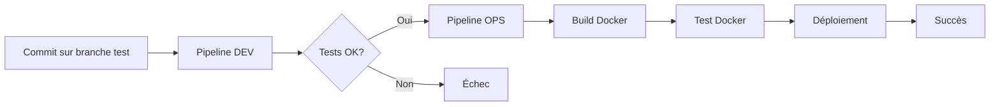

# Projet Tri à Bulles et Chaînes - C avec CI/CD Jenkins

## 🎯 Vue d'ensemble

Ce projet implémente deux algorithmes de tri à bulles distincts :
- **Tri à bulles d'entiers** (`main_bulles.c`)
- **Tri à bulles de chaînes de caractères** (`main_chaines.c`)

Chaque programme est autonome et peut être compilé/exécuté indépendamment.

## 📁 Structure du Projet

```
.
├── src/
│   ├── main_bulles.c          # Programme principal pour tri d'entiers
│   ├── main_chaines.c         # Programme principal pour tri de chaînes
│   ├── tri_bulles.c           # Implémentation du tri à bulles
│   ├── tri_bulles.h           # En-tête du tri à bulles
│   ├── tri_chaines.c          # Implémentation du tri de chaînes
│   └── tri_chaines.h          # En-tête du tri de chaînes
├── tests/
│   ├── test_tri_bulles.c      # Tests unitaires pour tri d'entiers
│   └── test_tri_chaines.c     # Tests unitaires pour tri de chaînes
├── build/                     # Dossier de compilation (généré)
├── Makefile                   # Configuration de compilation
├── Makefile.linux             # Makefile pour Docker (Linux)
├── Dockerfile                 # Configuration Docker
├── Jenkinsfile.dev.windows    # 🔵 Pipeline DEV (Windows)
├── Jenkinsfile.ops.windows    # 🟢 Pipeline OPS (Windows)
├── Jenkinsfile.dev.linux      # 🔵 Pipeline DEV (Linux)
└── Jenkinsfile.ops.linux      # 🟢 Pipeline OPS (Linux)
```

## 🚀 Fonctionnalités

### 1️⃣ Tri à bulles d'entiers (`main_bulles.c`)
- Tri à bulles classique pour les entiers
- Optimisation avec détection de tableau trié
- Affichage avant/après tri

### 2️⃣ Tri à bulles de chaînes (`main_chaines.c`)
- **Fonction swap** : `swap_chaines(char*, char*)`
- **Ordre ascendant** et **descendant**
- **Compteurs** : nombre de comparaisons et d'échanges
- **Statistiques** affichées après chaque tri

#### Exemple d'utilisation des chaînes :
```c
char mots[6][MAX_LONGUEUR] = {
    "bonjour", "hello", "world", 
    "apple", "banana", "cherry"
};

StatsTri stats;
tri_bulles_chaines(mots, 6, 1, &stats);  // 1 = ascendant, 0 = descendant
afficher_statistiques(stats);
```

**Sortie attendue (ascendant)** :
```
[ "apple", "banana", "bonjour", "cherry", "hello", "world" ]

=== Statistiques du tri ===
Nombre de comparaisons : 14
Nombre d'échanges      : 8
===========================
```

## 🔨 Compilation et Exécution

### Compilation locale

```bash
# Compiler tous les programmes
make all

# Compiler uniquement le tri d'entiers
make tri_bulles

# Compiler uniquement le tri de chaînes
make tri_chaines

# Nettoyer
make clean
```

### Tests

```bash
# Exécuter tous les tests
make test

# Tests tri d'entiers uniquement
make test_bulles

# Tests tri de chaînes uniquement
make test_chaines
```

### Exécution

```bash
# Exécuter les deux programmes
make run

# Exécuter individuellement
build\tri_bulles.exe
build\tri_chaines.exe
```

## 🐳 Docker

### Build et exécution

```bash
# Construire l'image
docker build -t tri-bulles-et-chaines-app .

# Exécuter les deux programmes (défaut)
docker run --rm tri-bulles-et-chaines-app

# Exécuter seulement le tri à bulles
docker run --rm tri-bulles-et-chaines-app tri_bulles

# Exécuter seulement le tri de chaînes
docker run --rm tri-bulles-et-chaines-app tri_chaines
```

## 🔄 Pipelines Jenkins

### 🔵 Pipeline DEV (`tri-bulles-et-chaines-dev`)

**Objectif** : Développement et validation jusqu'aux tests

**Stages** :
1. ✅ **Checkout** - Récupération du code (branche `test`)
2. ✅ **Vérification environnement** - GCC, Make
3. ✅ **Compilation** - Build des deux programmes
4. ✅ **Tests unitaires** - Exécution de tous les tests
5. ✅ **Exécution des programmes** - Validation fonctionnelle
6. ✅ **Rapport de tests** - Archivage des artefacts
7. 🔄 **Trigger OPS Pipeline** - Déclenchement automatique du pipeline OPS

**Configuration Jenkins** :
- **Nom** : `tri-bulles-et-chaines-dev`
- **Type** : Pipeline
- **Script Path** : `Jenkinsfile.dev.windows`
- **Branche** : `test`

**Artefacts générés** :
- `rapport_dev.txt`
- Binaires dans `build/`

---

### 🟢 Pipeline OPS (`tri-bulles-et-chaines-ops`)

**Objectif** : Déploiement complet avec Docker

**Stages** :
1. ✅ **Checkout** - Récupération du code (branche `test`)
2. ✅ **Vérification environnement** - GCC, Make, Docker
3. ✅ **Compilation** - Build des deux programmes
4. ✅ **Tests unitaires** - Validation complète
5. 🐳 **Build Docker Image** - Construction de l'image `tri-bulles-et-chaines-app`
6. 🐳 **Test Docker Image** - Test des deux programmes dans Docker
7. 🚀 **DEPLOY** - Déploiement
8. ✅ **Rapport de déploiement** - Documentation

**Configuration Jenkins** :
- **Nom** : `tri-bulles-et-chaines-ops`
- **Type** : Pipeline
- **Script Path** : `Jenkinsfile.ops.windows`
- **Branche** : `test`

**Artefacts générés** :
- `rapport_ops.txt`
- Image Docker : `tri-bulles-et-chaines-app:${BUILD_NUMBER}`
- Image Docker : `tri-bulles-et-chaines-app:latest`

**Commandes de déploiement** :
```bash
# Exécuter les deux programmes
docker run --rm tri-bulles-et-chaines-app:latest

# Exécuter seulement le tri à bulles
docker run --rm tri-bulles-et-chaines-app:latest tri_bulles

# Exécuter seulement le tri de chaînes
docker run --rm tri-bulles-et-chaines-app:latest tri_chaines
```

## 🔄 Workflow CI/CD



## 📊 Différences entre les Pipelines

| Aspect | Pipeline DEV 🔵 | Pipeline OPS 🟢 |
|--------|----------------|----------------|
| **Objectif** | Validation code | Déploiement complet |
| **Stages** | Jusqu'aux tests + exécution | Jusqu'au déploiement |
| **Docker** | ❌ Non | ✅ Oui |
| **Deploy** | ❌ Non | ✅ Oui |
| **Trigger** | Webhook GitHub | Automatique après DEV |
| **Utilisation** | Développement | Production |

## 📈 Exemple de sortie complète

### Tri à bulles d'entiers :
```
========================================
       PROGRAMME TRI À BULLES
========================================
Tableau avant tri : [ 64 34 25 12 22 11 90 ]
Tableau après tri : [ 11 12 22 25 34 64 90 ]
========================================
       TRI À BULLES TERMINÉ !
========================================
```

### Tri de chaînes :
```
========================================
       PROGRAMME TRI DE CHAÎNES
========================================
Tableau original : [ "bonjour", "hello", "world", "apple", "banana", "cherry" ]

--- Tri par ordre alphabétique ASCENDANT ---
Tableau trié (ascendant) : [ "apple", "banana", "bonjour", "cherry", "hello", "world" ]

=== Statistiques du tri ===
Nombre de comparaisons : 14
Nombre d'échanges      : 8
===========================

--- Tri par ordre alphabétique DESCENDANT ---
Tableau trié (descendant) : [ "world", "hello", "cherry", "bonjour", "banana", "apple" ]

=== Statistiques du tri ===
Nombre de comparaisons : 14
Nombre d'échanges      : 7
===========================

========================================
       TRI DE CHAÎNES TERMINÉ !
========================================
```

## 🔧 Configuration Jenkins

### Prérequis sur Jenkins

```bash
# Installer les plugins nécessaires
- Git plugin
- Pipeline plugin
- Docker Pipeline plugin (pour OPS)
- GitHub Integration plugin

# S'assurer que Jenkins a accès à :
- gcc
- make
- docker (pour pipeline OPS)
```

### Configuration des Webhooks GitHub

1. **Repository Settings** → **Webhooks** → **Add webhook**
2. **Payload URL** : `https://votre-ngrok-url.ngrok.io/github-webhook/`
3. **Content type** : `application/json`
4. **Events** : `Just the push event`
5. **Branches** : `test`

### Créer les jobs Jenkins

```bash
# Job 1: DEV
Nom: tri-bulles-et-chaines-dev
Type: Pipeline
Script Path: Jenkinsfile.dev.windows
Branche: test

# Job 2: OPS
Nom: tri-bulles-et-chaines-ops
Type: Pipeline
Script Path: Jenkinsfile.ops.windows
Branche: test
```

## 🎯 Points Clés du Projet

✅ **Deux programmes séparés** (`main_bulles.c` et `main_chaines.c`)  
✅ **Fonction swap** pour les chaînes de caractères  
✅ **Compteurs** de comparaisons et d'échanges  
✅ **Tri ascendant et descendant**  
✅ **Tests unitaires complets**  
✅ **2 Pipelines Jenkins distincts** (DEV et OPS)  
✅ **Intégration Docker** avec exécution individuelle  
✅ **Rapports automatisés**  
✅ **Workflow CI/CD complet** avec déclenchement automatique  
✅ **Support multi-plateforme** (Windows/Linux)  

## 🛠️ Support

Pour toute question sur :
- **Les algorithmes de tri** → Voir `src/tri_*.c`
- **Les programmes principaux** → Voir `src/main_*.c`
- **Les tests** → Voir `tests/test_*.c`
- **Les pipelines** → Voir `Jenkinsfile.*.windows`
- **Docker** → Voir `Dockerfile`

## 📝 Changelog

- **v2.0** : Refactorisation en deux programmes séparés
- **v1.0** : Implémentation initiale avec programme unique

---

**Auteur** : Elyes Hamani, Daouda Kone, Dylan Franc Ekie  
**Projet** : CI/CD avec Jenkins - Tri à Bulles et Chaînes  
**Date** : Octobre 2025  
**Branche** : `test`